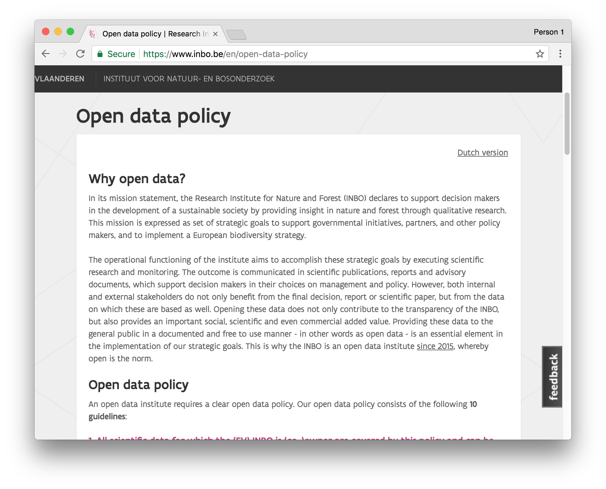
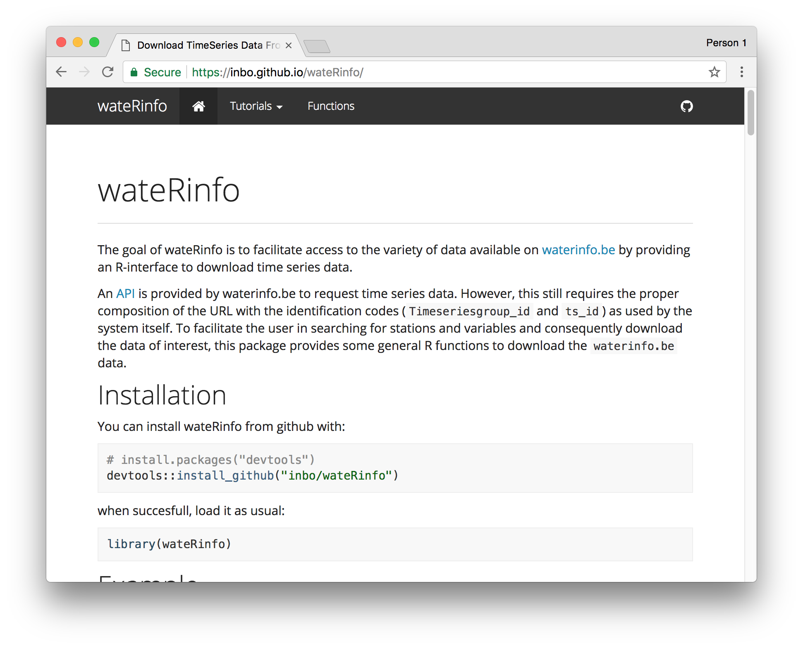
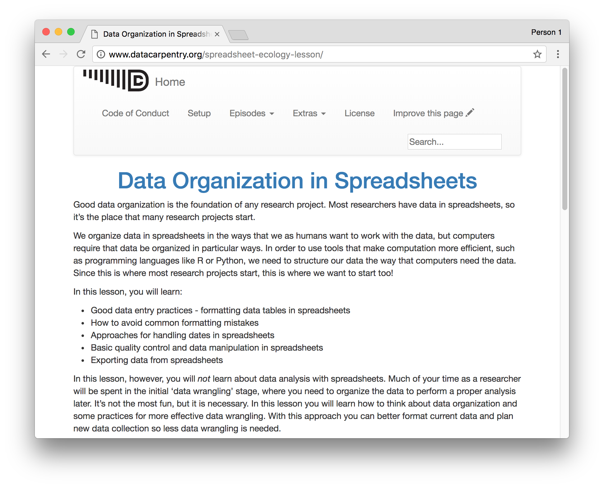

class: center, middle

# Tidy data exercise

### Data organization in spreadsheets

 
        
Adapted from http://datacarpentry.org 
by [Stijn Van Hoey](https://twitter.com/SVanHoey) and [Peter Desmet](https://twitter.com/peterdesmet) 
for the Biodiversity Data Management workshop 
28 February 2018

 

[<i class="fa fa-twitter"></i> @LifeWatchINBO](https://twitter.com/LifeWatchINBO) [<i class="fa fa-github"></i> github/inbo](https://github.com/inbo)

---
class: center, middle, section_background

# Introduction

---
class: center, middle

## Hi!
### We are the [LifeWatch team](https://pureportal.inbo.be/portal/en/organisations/lifewatch(0ab4aa1e-b25f-4dc3-90c1-ddcfbc726fe8.html) at INBO

---
class: center, middle

## We offer technical support to researchers

---
class: center, middle

## Open data publication

---
class: center, middle

## Research software development

---
class: center, middle

## We do things `open`, `reproducible` and `community-oriented`.

---
class: center, middle
background-image: url(./static/images/InnoScholComm_figure_jan2015.png)
        
.alert.alert-warning[
## Tools, tools, tools...
]
        
---
class: center, middle
background-image: url(./static/images/good_enough_practices_computational_science.png)

.alert.alert-success[
## Good practices >>> tools
]
        
.footnote[Wilson et al. (2017). <https://doi.org/10.1371/journal.pcbi.1005510>]

---
class: center, middle

## In this workshop, we focus on `data`
        
---
class: center, middle

## Data organization

is the foundation of your research project

---
class: center, middle

.emphasize.left[
<i class="fa fa-quote-left fa-3x fa-pull-left"></i> Data that is easy to model,  visualize and aggregate
]
    

.emphasize.right[
<i class="fa fa-quote-left fa-3x fa-pull-right"></i> Create the data you wish  to see in the world
]

---
class: center, middle

## Course from Data Carpentry

---
class: center, middle, section_background

# Spreadsheets

---
class: center, middle

## Survey

<https://hackmd.io/s/ryiIwtYIG>

---
class: center, middle

## Discussion

(and what we will not cover here)

---
class: center, middle, section_background
        
# Tidy your data

(how to format data in spreadsheets)

---
class: center, middle
background-image: url(./static/images/tidy_data_paper.png)
        
.footnote[Hadley Wickham (2014) Tidy Data. Journal of Statistical Software, Vol. 59, Issue 10. <https://doi.org/10.18637/jss.v059.i10>]

---
class: center, middle

## un-tidy

| WWTP | Treatment A | Treatment B |
|:------|:-------------:|:-------------:|
| Destelbergen | 8.  | 6.3 |
| Landegem | 7.5  | 5.2 |
| Dendermonde | 8.3  | 6.2 |
| Eeklo | 6.5  | 7.2 |

--
count: false

## tidy

| WWTP | Treatment | pH |
|:------|:-------------:|:-------------:|
| Destelbergen | A  | 8. |
| Landegem | A  | 7.5 |
| Dendermonde | A  | 8.3 |
| Eeklo | A  | 6.5 |
| Destelbergen | B  | 6.3 |
| Landegem | B  | 5.2 |
| Dendermonde | B  | 6.2 |
| Eeklo | B  | 7.2 |

---
class: center, top

## tidy

.alert.alert-success.left[
* Each `observation` forms a **row**
]

| WWTP | Treatment | pH |
|:------|:-------------:|:-------------:|
| Destelbergen | A  | 8. |
| Landegem | A  | 7.5 |
| Dendermonde | A  | 8.3 |
| Eeklo | A  | 6.5 |
| Destelbergen | B  | 6.3 |
| Landegem | B  | 5.2 |
| Dendermonde | B  | 6.2 |
| Eeklo | B  | 7.2 |

---
class: center, top
count: false

## tidy

.alert.alert-success.left[
* Each `observation` forms a **row** 
* Each `variable` forms a **column** and contains **values**
]

| WWTP | Treatment| pH |  Temperature (°C)  |
|:------|:-------------:|:-------------:|:----:|
| Destelbergen | A  | 8. | 13.1 |
| Landegem | A  | 7.5 |  16.9 | 
| Dendermonde | A  | 8.3 | 18.3 |
| Eeklo | A  | 6.5 | 14.4 |
| Destelbergen | B  | 6.3 | 17.2 |
| Landegem | B  | 5.2 | 11.9 |
| Dendermonde | B  | 6.2 | 17.1 |
| Eeklo | B  | 7.2 | 19.0 |

---
class: center, top
count: false

## tidy

.alert.alert-success.left[
* Each `observation` forms a **row** 
* Each `variable` forms a **column** and contains **values** 
* Each type of `observational unit` forms a **table**
]

| WWTP | Treatment| pH |  Temperature (°C)  |
|:------|:-------------:|:-------------:|:----:|
| Destelbergen | A  | 8. | 13.1 |
| Landegem | A  | 7.5 |  16.9 | 
| Dendermonde | A  | 8.3 | 18.3 |
| Eeklo | A  | 6.5 | 14.4 |
| ... | ...  | ... | ... |

| WWTP | country  | decimalLatitude | decimalLongitude | 
|:------|:-------------:|:-------------:|:----:|
| Dendermonde | BE  | 51.0248 | 4.136 |
| Destelbergen | BE  | 51.051 | 3.774 |
| Landegem |BE  | 51.052 |  3.568 | 
| ... | ...  | ... | ... |

---
class: center, middle

## Exercise

.left[
1. Pair up with a buddy
2. Download: https://ndownloader.figshare.com/files/2252083
3. Never modify the **raw** data
3. Make it tidy
4. Document the steps
]

---
class: center, middle

## Discussion

<https://hackmd.io/s/ryiIwtYIG>

---
class: center, middle, section_background

# Exporting data

---
class: center, middle

## Exercise

Export your data as a `csv`

---
class: center, middle

## Discussion

---
class: center, middle, section_background

# Importing data

---
class: center, middle

## Demo

---
class: center, middle, section_background

# Resources

---
class: left, middle

This course:

* [Data Organization in Spreadsheets](http://www.datacarpentry.org/spreadsheet-ecology-lesson/), on which this course is based
* [GitHub repository for this course](https://github.com/inbo/dwc-in-R)

Other resources:

* [Data Carpentry](http://www.datacarpentry.org/lessons/) and [Software Carpentry](https://software-carpentry.org/lessons/) courses
* rOpenSci [reproducibility guide](http://ropensci.github.io/reproducibility-guide/)
* [Many other resources](https://github.com/ecoinfAEET/Reproducibilidad/blob/master/Recursos.Rmd)
