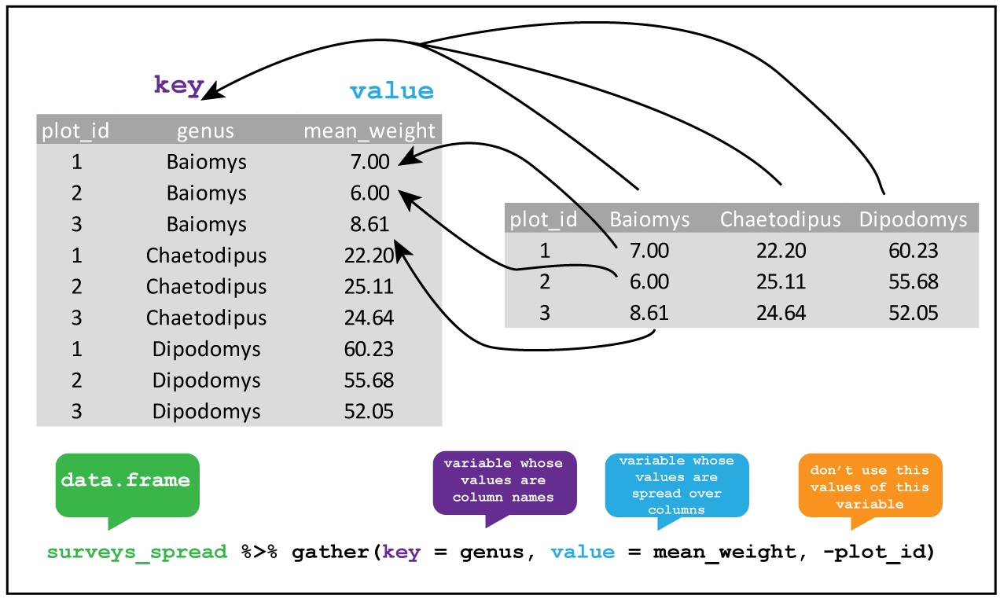

```{r setup, include = FALSE}
knitr::opts_chunk$set(echo = TRUE, warning = FALSE, message = FALSE)
```

This tutorial will provide you the know-how for importing and analysing (tidy) data. We will use the same dataframe to test the most typical dplyr functionlalities. There is no better way to improve your programming skills than trying it yourself.

First of all, we need to load some libraries which are part of the tidyr ecosystem:

```{r library_to_read_data}
library(readr)
```

```{r libraries_to_manipulate_data}
library(dplyr)
library(tidyr)
library(magrittr)
```

# Read data

First of all, we need to import data in R. The most user friendly way to do it is by using the interface provided by RStudio. In the Environment window, click on `Import Dataset` and select `From Text (readr)...`. A window will pop-up. Follow the next steps:

1. Click on `Browse` to selet the text file you want to import
2. Select the right delimiter
3. Check whether the class of the column values fits your purpose and in case apply changes by clicking on the class name below the column name
4. Change variable name in `code preview` if you prefer to save the data with a different name than filename
5. Click on `Import`

A dataframe is automatically generated and, very handy, the code to generate it as well!
We suggest to use this graphic interface at the beginning in order to be familiar with the most typical parameters (e.g. `sep`,  `col_types`, `col_names`, `row_names`). After a while you will find that writing the code is way faster than a long series of mouse clicks.

## Exercises

1. Read `survey_data_spreadsheet_tidy.csv`. Check whether the columns match the following types:
    1. `date`: `double`
    2. `species`: `character`
    3. `plot`: `integer`
    4. `sex`: `character`
    5. `weight_in_g`: `integer`
    6. `device_remarks`: `character`
2. Save the data into `data`

```{r read_and_save_data}
data <- read_delim("../data/interim/survey_data_spreadsheet_tidy.csv", ";", 
  escape_double = FALSE, 
  trim_ws = TRUE
)
```

```{r second_way_via_read_csv_and_read_csv2}
data <- read_csv2 ("../data/interim/survey_data_spreadsheet_tidy.csv")
```


# Explore data

Before to start manipulate data, it is best practice exploring the imported dataframe in order to check whether everything is corectly imported and to have an idea about the data we are going to analyse/manipulate. R gives us several tools to do it, which you can test immediately by using one of the many dataframes from the [R Datasets package](https://stat.ethz.ch/R-manual/R-devel/library/datasets/html/00Index.html), automatically loaded when you open R. We will use the `CO2` dataframe about the carbon dioxide uptake in grass plant *Echinochloa crus-galli* (details can be found [here](https://stat.ethz.ch/R-manual/R-devel/library/datasets/html/zCO2.html))

1. **`head(CO2)`** returns the first part of a data frame. It works with several other data types (vectors, tables, ...). Specifiy how many rows to display with parameter `n`: `haed(CO2, n = )`, default `n = 6`
2. **`view(CO2)`** opens the entire dataframe in viewer. If dataframe is very big, then your computer can slow down sensibly and Rstudio can eventually crash. Be aware of it!
3. **`class(CO2)`** if `CO2` is a dataframe then `"data.frame"` will show up
4. **`str(CO2)`** displays the internal structure of the dataframe
5. **`col_names(CO2)`** display column names
6. **`nrow(CO2)`** returns the number of rows of the dataframe
7. **`ncol(CO2)`** return the number of rows of the dataframe

## Exercises

Test the functions introduced above to our dataframe `data`. In particular:

1. Display column names

```{r col_names}
colnames(data)
```

2. How many columns are there?

```{r n_cols}
ncol(data)
```

3. How many rows are there?

```{r n_rows}
nrow(data)
```

4. Display the first 10 records

```{r head}
head(data, n = 10)
```

5. Display data in viewer

```{r view}
View(data)
```

6. Display structure of data

```{r structure}
str(data)
```

# Sort data

It is normally useful to sort data. The package `dplyr` offers the function `arrange()` to do it:
```{r arrange_example}
arrange(CO2, conc, uptake)
```

Use parameter `desc(col_name)` to sort in descending order:

```{r arrange_desc_example}
arrange(CO2, desc(conc), desc(uptake))
```


## Exercises

1. Sort by `date` in ascending order

```{r sort_data_by_date}
arrange(data)
data <- arrange(data)
```

2. Overwrite `data` with sorted output

```{r sort_and_overwrite}
arrange(data)
data <- arrange(data)
```

# Select columns and rows

You can select specific columns of a dataframe by `select()`. Only columns where conditions are true are selected. For example, selecting a column by its column name: 

```{r example_select}
select(CO2, uptake)
```

To select all columns except a specific column use the minus symbol before its name:

```{r example_select_minus}
select(CO2, -uptake)
```

To select rows use `filter()`. Again, one or multiple filters can be applied to filter the targeted rows:

```{r}
filter(CO2, 
       Type == "Quebec", 
       Treatment == "nonchilled", 
       conc  < 200)
```
A condition can be any logical operator (`>`, `>`, `<=`,...). For example, to get only those rows for which the `weight_in_g` is smaller than 40, use `filter(data, weight_in_g < 40)`.

## Exercises

1. Display the column `weight_in_g`

```{r select}
select(data, weight_in_g)
```

2. Display only the records with `weight_in_g > 30`

```{r filter}
filter(data, weight_in_g > 30)
```

3. Select females with `weight_in_g > 30`

```{r filter_two_conditions}
filter(data, weight_in_g > 30, sex == "F")
```

4. Display only `weight_in_g` of females with `weight_in_g > 30`

```{r filter_and_select}
females_weight_above_30_all <- filter(data, weight_in_g > 30, sex == "F")
select(females_weight_above_30_all, weight_in_g)
```

5. Save output of (4) as `females_weight_above_30`

```{r save_output}
females_weight_above_30 <- select(females_weight_above_30_all, weight_in_g)
```

6. Select all columns from `data` except the `device_remarks` column

```{r select_all_except_this}
select(data, -device_remark)
```

# Pipes

As you probably noticed, we need to create new variables everytime we want to apply two or more functions. This method has several disadvantages, i.a. messy workspace, high memory space usage, and higher chance of typos.

An alternative is to wrap (*nest*) functions one within each other, so that the output of a function would be considered the input of the other one. For example, if we have to apply `f1` to a dataframe `df` and `f2` to the output of `f1`, we write: 

```r
f2(f1(df, ...), ...)
```

```{r nesting_example}
filter(select(CO2, uptake), uptake > 30, uptake < 31.8)
```

This way of working with functions is typical of programming and is implemented in many other programming languages. The disadvantage of this approach is readibility: you have to read from right to left in order to understand what happens with our data!

Can we avoid deciphering nested function calls, and making excessive use of temporary variables? The answer is yes, thanks to *pipe* operators. The most used one is the *forward pipe*: `%>%`, from the magrittr package. We can then rewrite the example above by using `%>%`:

```r
df %>% f1(...) %>% f2(...)
```

```{r piping_example1}
CO2 %>% 
  select(uptake) %>% 
  filter(uptake > 30, uptake < 31.8)
```

Easy, isn't?
As Stefan Milton, author of magrittr, wrote in [this](https://www.r-statistics.com/2014/08/simpler-r-coding-with-pipes-the-present-and-future-of-the-magrittr-package/) blogpost:

> The order in which you’d think of these steps is the same as the order in which they are written, and as the order in which they are executed.

If you want to create a variable based on the output of a series of functions:

```r
df2 <- df %>% f1(...) %>% f2(...)
```

```{r piping_example2}
small_uptakes <- CO2 %>% 
  select(uptake) %>% 
  filter(uptake > 30, uptake < 31.8)
```

If you want to overwrite the input dataframe, you can use the *compound assignment operator*, `%<>%` which can be read as the composition of the forward pipe `%>%`, and asignment symbol `<-`:

```r
df %<>% f1(...) %>% f2(...)
```

We apply all steps on the right of `%<>%` to `df` and overwrite it with the final ouput.

```{r}
small_uptakes %<>% filter(uptake < 31)
small_uptakes
```

Notice that `%<>%` is part of magrittr package.

## Exercises

1. Display the column `weight_in_g` with values > 30 using pipes

```{r pipes1}
data %>% select(weight_in_g) %>%
  filter(weight_in_g > 30)
```

2. Select females with `weight_in_g > 30` using pipes

```{r pipes2}
data %>% filter(sex == "F", weight_in_g > 30)
```

3. Display only weight_in_g of females with weight in g > 30 

```{r pipes3}
data %>% 
  filter(sex == "F", weight_in_g > 30) %>%
  select(weight_in_g)
```

4. Save output of (3) as a variable: `females_weight_above_30`

```{r pipes4}
females_weight_above_30 <- data %>% 
  filter(sex == "F", weight_in_g > 30) %>%
  select(weight_in_g)
```

# distinct

The function `distinct()` retains only unique/distinct values of an input vector. If applied to dataframe, it retains only unique/distinct rows. For example, to know which types of plants were used:
```{r}
CO2 %>%
  select(Type) %>%
  distinct()
```

## Exercises

1. Show the unique sex values

```{r unique_sex}
data %>% 
  select(sex) %>%
  unique()
```

2. Show the unique species values

```{r unique_species}
data %>% 
  select(species) %>% 
  unique()
```

# group_by and summarize

By using  `select()` you can for example calculate minimum or maximum of a specific column. 
The minimum uptake:

```{r}
CO2 %>% 
  select(uptake) %>%
  min()
```

And the maximum uptake:

```{r}
CO2 %>% 
  select(uptake) %>%
  max()
```

But what if you want to calculate the minimum and maximum uptake for each plant?
You need then to split the data by `Plant` values and calculate the mimnimum and maximum for each group.  We can do it via `%>%` and two functions from dplyr library: `group_by()` and `summarize()`:

```{r}
CO2 %>%
  group_by(Plant) %>%
  summarize(min_uptake = min(uptake),
            max_uptake = max(uptake))
```


Theoreticallyn this kind of workflow is called the *split-apply-combine paradigm*: *split* the data into groups, *apply* some analysis to each group, and then *combine* the results together.Interesting to notice that `group_by` actually doesn't modify the data contained in the dataframe, but adds an internal grouping to the dataframe, which is visible if you run:

```{r class_after_groupby}
class(CO2%>% group_by(Plant))
```

For counting how many rows (with unique) in each group you can use `count()` instead of `summarize()`:

```{r count_example}
CO2 %>% group_by(Plant) %>% count()
```

or even more compact:

```{r count_example_compact}
CO2 %>% count(Plant)
```

## Exercises

1. Count records per sex

```{r}
data %>% count(sex)
```

2. What is the mean weight? Consider to use function `mean()` combined with parameter `na.rm = TRUE` in order to ignore (remove) `NA` while calculating the mean

```{r}
data %>% summarize(mean_weight = mean(weight_in_g, na.rm = TRUE))
```

3. Show mean weight per sex

```{r group_by_summarize()}
data %>% filter(!is.na(weight_in_g)) %>% 
  group_by(sex) %>% summarize(sum = sum(weight_in_g))
```

4. Show mean weight per sex and species

```{r summarize_mean}
data %>% filter(!is.na(weight_in_g)) %>% 
  group_by(sex, species) %>% 
  summarize(mean_weight = mean(weight_in_g))
```

5. Show minimum, maximum and mean weight per sex and species and save output as `weight_per_species_sex`. Consider to use `min()` and `max()`) combined with parameter `na.rm = TRUE` in order to ignore `NA` while calculating minimum and maximum

```{r multiple_summarize}
weight_per_species_sex <- data %>% 
  filter(!is.na(weight_in_g)) %>% 
  group_by(sex, species) %>% 
  summarize(min_weight = min(weight_in_g),
            max_weight = max(weight_in_g),
            mean_weight = mean(weight_in_g))
weight_per_species_sex
```

# Reshaping: spread and gather

These two functions provide opposite functionalities. While `spread()` *spreads* rows into columns,  `gather()` *gathers* columns into rows. An example can be found in these two images from [Data Carpentry](http://www.datacarpentry.org/R-ecology-lesson/03-dplyr.html#reshaping_with_gather_and_spread):



Notice that  `spread()` and `gather()` aren't dplyr functions but come from the tidyr library.

## Exercises

1. Spread `weight_per_species_sex` to key on  `sex` and values from `mean_weight` and save output as `weight_per_species_sex_spread`

```{r}
weight_per_species_sex_spread <- weight_per_species_sex %>% 
  spread(key = sex, value = mean_weight)
head(weight_per_species_sex_spread, n = 10)
```

2. Gather back the data and save output as `weight_per_species_sex_gather`. Is `weight_per_species_sex_gather` equal to `weight_per_species_sex`?

```{r}
weight_per_species_sex_gather <- weight_per_species_sex_spread %>%
  gather(sex, mean_weight, "F", "M", na.rm = TRUE, convert = TRUE)
head(weight_per_species_sex_gather, n = 10)
head(weight_per_species_sex, n = 10)
colnames(weight_per_species_sex_gather) == colnames(weight_per_species_sex)
```

# rename and mutate

Sometimes you need to rename one or more columns. You can do it using function `rename()`:

```r
df %>% rename(new_colname = old_colname)
```
An example:

```{r rename_example}
CO2 %>% rename(Conc = conc)
```

Another typical data analysis task is to create new columns based on the values of existing ones, like converting units or calculating the ratio of values in two columns. We can use the function `mutate()`:

```r
new_df <- df %>% mutate(new_column = ...)
```
An example using `CO2` dataframe: 

```{r mutate_example2}
CO2_dev_mean <- CO2 %>% mutate(dev_mean_uptake = uptake - mean(uptake))
```

or you can modify the original dataframe:

```r
df %<>% mutate(new_column = ...)
```

```{r mutate_example}
CO2 %<>% mutate(dev_mean_uptake = uptake - mean(uptake))
head(CO2)
```

You can also use `mutate()` to change the values in a column without creating a new one. In the example below we change the new column `dev_mean_uptake` by applying absolute value:

```{r}
CO2 %<>% mutate(dev_mean_uptake = abs(dev_mean_uptake))
head(CO2)
```

## Exercises

1. Rename column `weight_in_g` of `data` to `weight` and overwrite `data`

```{r rename_weight}
data %<>% rename(weight = weight_in_g)
colnames(data)
```

2. Convert `weight` values in gram to kg

```{r weight_in_kg}
data %>% mutate(weight = weight / 1000)
```

3. Add column `country` with a fixed value `US`

```{r add_country}
data %>% mutate(country = "US")
```

4. Add column `parsed_date` by applying the function `as.Date(column)` to the `date` column

```{r parse_date}
data %>% mutate(parsed_date = as.Date(date))
```

# Recode your data: recode and case_when

Have you ever wanted to use a kind of *find and replace* function in R? Then it's time to use the dplyr functions `recode()` and  `case_when`: the first function allows you to replace specific values based on a logical condition and it works with vectors. An example:

```{r recode_example1}
types <- CO2$Type # extract Type from dataframe
recode(types, 
       Quebec = "Canada",
       Mississippi = "USA")
```

You can specify a `default` value: it will be given to all values not otherwise matched. And if you want replace missing values (NA), then you can specify a value to the parameter `missing`.

```{r recode_example2}
recode(types, 
       Quebec = "Canada",
       .default = "World")
```

A similar function is `case_when()` which allows you to vectorise multiple `if` and `if else` statements and it works with vectors and dataframes as well. `case_when()` is often used inside `mutate()` when you want to make a new column (or change an existing one) based on a complex combination of existing variables. An example:

```{r case_when_example}
CO2 %>% mutate(
    response_level = case_when(
      uptake / conc > 0.15 ~ "high",
      uptake / conc > 0.1 ~ "medium",
      TRUE ~  "low")
    )
```

Based on the ratio between uptake and carbon dioxide concentration, a new variable, `response_level`, is created with values based on the conditions listed in `case_when()`.

## Exercise

1. Add column `scientific_name` with the full scientific name of each species based on the table below and save the output in `data_scientificname`:

species | scientific name
| --- | --- |
DM | Dimarella riparia (Navas, 1918)
DO | Dondice occidentalis (Engel, 1925)
DS | Distonemurus desertus Krivokhatsky, 1992
OL | Olios scepticus Chamberlin, 1924
PE | Petrochelidon nigricans (Vieillot, 1817)
PF | Piffliella eduardi Hammer, 1979
OT | Ottoicus dissitus Drake, 1960
OX | Oxybelus pallidus Arnold, 1927
NA | Not Available


```{r case_when}
data_scientificname <- data %>% 
  mutate(scientific_name = case_when(
    species == "DM" ~ "Dimarella riparia (Navás, 1918)",
    species == "DO" ~ "Dondice occidentalis (Engel, 1925)",
    species == "DS" ~ "Distonemurus desertus Krivokhatsky, 1992",
    species == "OL" ~ "Olios scepticus Chamberlin, 1924",
    species == "PE" ~ "Petrochelidon nigricans (Vieillot, 1817)",
    species == "PF" ~ "Piffliella eduardi Hammer, 1979",
    species == "OT" ~ "Ottoicus dissitus Drake, 1960",
    species == "OX" ~ "Oxybelus pallidus Arnold, 1927",
    is.na(species) ~ "Not Available"
    )
  )
```

# Export your data

When satisfied about the cleaned data, maybe you would like to save the output. You can save a dataframe object by means of function `write_table()`:

```r
write.table(df, file = "./save/it/here/df.csv", ...)
```

You can use optional arguments to specify the output. The most used are:

- `sep`, to specify which character should be used to separate the values, e.g. a comma `","` for comma separated values or a tab `\t` for tab-delimited values
- `row.names`, a logical, TRUE or FALSE, whether you want or not row numbers or row names (if specified in your dataframe) in the file.
- `col.names`, a logical, TRUE or FALSE, indicating the presence of column names in the first line of the file
- `append`, a logical, TRUE or FALSE. Default value: FALSE. If the specified file already exists, it would be overwritten, while `append = TRUE` will append the dataframe at the end of the file.
 
## Exercises

1. Export `females_weight_above_30` to a tab delimited csv file:
`../data/processed/females_weight_above_30.csv`. Add column names but no row names/indexes

```{r}
write.table(females_weight_above_30, 
            file = "../data/processed/females_weight_above_30.csv",
            sep = "\t",
            col.names = TRUE,
            row.names = FALSE)
```

2. Export `data_scientificname` to a comma separated file:
`../data/processed/data_scientificname.csv`. Add column names and row names/indexes as well.

```{r}
write.table(data_scientificname, 
            file = "../data/processed/data_scientificname.csv",
            sep = ",",
            col.names = TRUE,
            row.names = TRUE)
```
