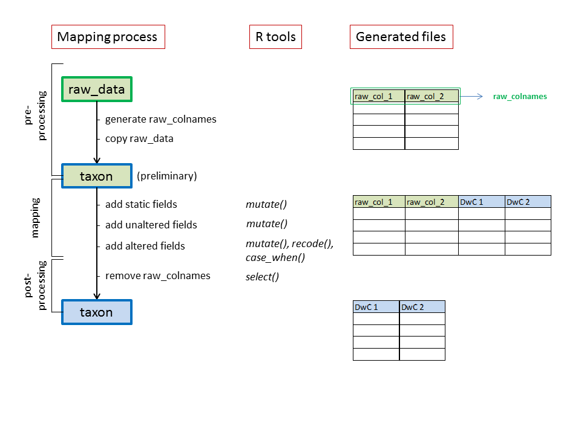
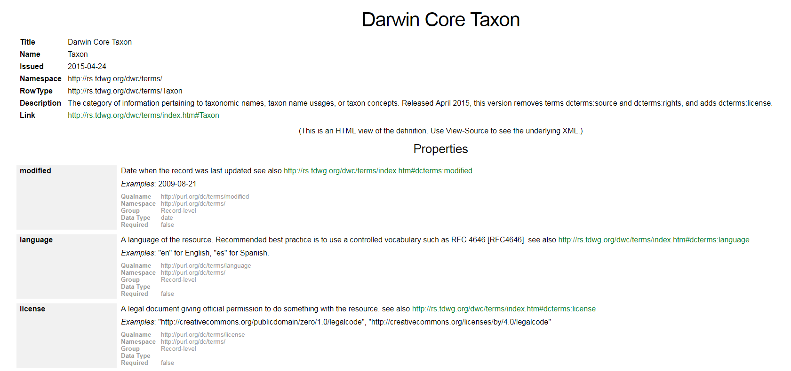

# Introduction

This tutorial describes how to standardize or map data to Darwin Core using R. We'll mainly use functions from the **dplyr package** (see our [introduction to dplyr](dplyr.html)). We recommend using a step-by-step approach mapping data to Darwin Core:

```
1. Setup
  - Load libraries
  - Define locale
2. Import and clean data
  - Import data
  - Inspect data
  - Clean data
3. Map to Darwin Core Archive
  - Pre-processing
  - Mapping
  - Post-processing
```

We'll walk through the tutorial step-by-step by using the [Inventory of alien macroinvertebrates in Flanders, Belgium](https://doi.org/10.15468/yxcq07) as an example. Afterwards, you can try it yourself by mapping the [Checklist of non-native freshwater fishes in Flanders, Belgium](https://doi.org/10.15468/xvuzfh).

# Setup

```{r setup, echo = FALSE}
knitr::opts_chunk$set(echo = TRUE, warning = FALSE, message = FALSE)
```

We load the libraries necessary to _import_, _clean_ and _map_ the data:

```{r}
library(tidyverse) # For data transformation (included dplyr)
library(magrittr)  # For %<>% pipes
library(readxl)    # For reading excel files
library(janitor)   # For basic cleaning of the data
```

Before we load the data, we define the `locale`:

```{r}
Sys.setlocale("LC_CTYPE", "en_US.UTF-8")
```

# Import and clean data

## Import data

Our raw datasat is an Excel file (`AI_2016_Boets_etal_Supplement.xls`). The import specifications for Excel files are more limited than those for delimited files (`csv`, `tsv`, `txt`). However, we think it's useful to use Excel as a format in this exercise as this is often used to manage datasets.

1. Go to `Environment` panel: `Import dataset > From Excel...`
2. For `File/URL`, click `Browse` and select `AI_2016_Boets_etal_Supplement.xls`
3. Specify the `Import Options`:
    * `Name`: `raw_data`
    * `Sheet`: `checklist`
    * `NA`: `NA` or leave empty
    * `First Row as Names`: check
4. Click on `Data preview` to verify if everything looks OK
5. Click `Import` to generate the dataframe

```{r, echo = FALSE}
raw_data <- read_excel("../data/raw/AI_2016_Boets_etal_Supplement.xls", sheet = "checklist")
```

## Inspect data

The simplest way for a quick overview of the raw data is by using the functions `str()` and `head()`: 

```{r}
str(raw_data) 
```

```{r}
head(raw_data) # Displays the first 6 lines of the dataframe
```

## Clean data

We assume here that your dataset is tidy. If this is not the case, we refer to the [Tidy data exercise]. Unfortunately, starting with untidy data will make your script a lot more complex, with many preparatory steps before you can even start mapping! In a tidy dataset, you can start the mapping immediately.

In some cases, some small cleaning steps could be made to clean `raw_data`. Here, the column names of `raw_data` contain capital letters:

```{r}
colnames(raw_data)
```

It's easier to use lower case letters only and to discard all spaces in the column names. The package `janitor` provides some useful tools for this:

```{r}
raw_data %<>% clean_names()    
```

```{r, echo = FALSE}
colnames(raw_data)
```

During the mapping, we will sequentially add new Darwin Core terms (see further). To avoid name clashes between the original columns in `raw_data` and the added Darwin Core columns, we add the prefix `raw_` to the column names of `raw_data`:

```{r}
# Add prefix `raw_` to the column names of `raw_data`.
colnames(raw_data) <- paste0("raw_", colnames(raw_data))
```

```{r, echo = FALSE}
colnames(raw_data)
```

We're now all set to start mapping!

# Map to Darwin Core Archive

Even though `raw_data` contains all necessary information in a single data frame, a Darwin Core Archive might consist of multiple files, e.g. a core and extensions. We recommend to create the core file first and then the extensions. For each file, there are 3 steps:

1. **Pre-processing step**: basic preparations before the mapping
2. **Mapping**: sequential addition of the Darwin Core fields based on the raw values
3. **Post-processing step**: removing the raw values and saving the file



This is repeated for each core/extension file. Below, we'll use the **taxon core** as an example.

## Pre-processing

We use a **copy** of `raw_data` as the starting point for the mapping of the taxon core. This is because `raw_data` is the **starting point** for the mapping of both the taxon core and the extensions. It needs to be untouched each time we start the mapping process.

```{r}
taxon <- raw_data # Generate taxon by making a copy of raw_data
```

Sometimes there are further pre-processing steps needed. E.g. in a vernacular name extension each name is a _row_, while in the original data the names could be _columns_ or _delimited values within a column_. That kind of data requires `separate()` en `gather()` steps first. Here however, each record is taxon and no further pre-processing steps are required.

## Mapping

The mapping process is **sequential**: we add the Darwin Core terms to `taxon` step by step. The Darwin Core terms for each core/extension file can be found on the [GBIF Resources page](http://rs.gbif.org/):

[](http://rs.gbif.org)

It is good practice to inspect the Darwin Core terms on this webpage one by one to see whether a particular term can be used in your checklist. We respect the order of the terms as they listed on the GBIF resource page.

We distinguish **three types** of Darwin Core terms mappings (static values, unaltered values and altered values) and for each one we will use `mutate()` and `%<>%` (double pipe).

## Static values

Static values are used for Darwin Core terms that need the same value for all records. Most often, they are absent in `raw_data`. This mostly concerns **metadata fields** in the taxon core file:

```{r}
taxon %<>% mutate(language = "en")
```

```{r}
taxon %<>% mutate(license = "http://creativecommons.org/publicdomain/zero/1.0/")
```

```{r}
taxon %<>% mutate(rightsHolder = "Ghent University Aquatic Ecology")
```

```{r}
taxon  %<>% mutate(datasetID = "https://doi.org/10.15468/yxcq07")
```
 
```{r}
taxon %<>% mutate(datasetName = "Inventory of alien macroinvertebrates in Flanders, Belgium")
```

Other, non-metadata fields:

```{r}
taxon %<>% mutate(kingdom = "Animalia")
```

```{r}
taxon %<>% mutate(nomenclaturalCode = "ICZN")
```

All these fields are added as extra columns to the data frame, in the same order as they were added:

```{r echo = FALSE}
head(taxon)
```

## Unaltered values

Unaltered values are used for Darwin Core terms for which the content is an exact copy of the corresponding field in `raw_data`. This contrasts with **altered fields**, in which use a certain field in `raw_data` is the **basis** for further processing.

Before deciding whether or not some basic processing is required, it is useful to screen the variables in `raw_data` for their specific content. `distinct()` is a useful function to show the unique values for a field:

```{r}
taxon %>% distinct(raw_phylum)
```

<div class="alert alert-warning">
**Note**

We use `%>%` instead of `%<>%`, as we don't want to add a new column to `taxon`.
</div>

Some unaltered fields:

```{r}
taxon %<>% mutate(taxonID = raw_taxon_id)
```

```{r}
taxon %<>% mutate(scientificName = raw_species)
```

```{r}
taxon %<>% mutate(family = raw_family)
```

View those 3 fields:

```{r echo = FALSE}
taxon %>% select(-(taxonID:family))
```

## Altered values

Altered values are used for Darwin Core terms for which the content  in `raw_data` is used as a basis, but it needs to be standardized. This applies to Darwin Core terms for which we use a [vocabulary](http://rs.gbif.org/vocabulary/gbif/) or where we want to transform for clarity or to correct obvious mistakes.

The main functions we use for these are: `mutate()` + `recode()` or  `mutate()` + `case_when()`.

### `mutate()` + `recode()`

In this case, we aim to replace specific information in `raw_data` by new information specified in the code. For instance, `raw_order` will be mapped to the Darwin Core term `order`:

```{r}
taxon %>% distinct(raw_order)
```

`Veneroida` is a typo. We need to replace this by `Venerida`:

```{r}
taxon %<>% 
  mutate(order = recode(raw_order, "Veneroidea" = "Venerida")) 
```

We use `select()`, `group_by_all()` and `summarize()`to compare our newly mapped data with the original data. Note that the other values remain unaltered:

```{r}
taxon %>%
  select(raw_order, order) %>%
  group_by_all() %>% 
  summarize()
```

Another use case:

`raw_phylum` will be mapped to to Darwin Core term `phylum`. 

```{r}
taxon %>% distinct(raw_phylum)
```

However, Crustacea is not a phylum but a subphylum. The phylum to which crustaceans belong is `Arthropoda`. We can correct this with `recode()`:

```{r}
taxon %<>% mutate (phylum = recode(raw_phylum, "Crustacea" = "Arthropoda"))
```

Other use cases (not applicable to our data):

``` {r, eval = FALSE}
distribution %<>% mutate(description = recode(raw_d_n,
  "Ext.?"     = "Ext.",
  "Ext./Cas." = "Cas.",
  "Cas.?"     = "Cas.",
  "Nat.?"     = "Nat.",
  .missing = ""))

distribution %<>% mutate(locality = recode(value,
  "AF"     = "Africa (WGSRPD:2)",
  "AM"     = "pan-American",
  "AS"     = "Asia",
  "AS-Te"  = "temperate Asia (WGSRPD:3)",
  "AS-Tr"  = "tropical Asia (WGSRPD:4)",
  "AUS"    = "Australasia (WGSRPD:5)",
  "Cult."  = "cultivated origin",
  "E"      = "Europe (WGSRPD:1)",
  "Hybr."  = "hybrid origin",
  "NAM"    = "Northern America (WGSRPD:7)",
  "SAM"    = "Southern America (WGSRPD:8)",
  "Trop."  = "Pantropical",
  .default = "",
  .missing = ""
))
```

### `mutate()` + `case_when()`

`case_when` is often used together with `mutate()` when you want to make a new column (or change an existing one) based on the content of other existing variables.

For instance, [taxonRank](http://rs.gbif.org/vocabulary/gbif/rank_2015-04-24.xml) information is lacking in `raw_data`. We need to generate this information based on the information contained in `raw_species`:

Inspect `raw_species`:

```{r}
taxon %>% distinct(raw_species)
```

Although most `raw_species` are in fact species, `Dreissena rostriformis bugensis` is not a species but a subspecies. We need to make this distinction in the mapping process:

```{r}
taxon %<>% mutate(taxonRank = case_when(
  raw_species == "Dreissena rostriformis bugensis" ~ "subspecies",
  raw_species != "Dreissena rostriformis bugensis" ~ "species")
)
```

We use `select()`, `group_by_all()` and `summarize()`to compare our newly mapped data with the original data:

```{r}
taxon %>% select(raw_species, taxonRank) %>%
  group_by_all() %>% 
  summarize()
```

Other use cases (not applicable to our data):

```{r, eval=FALSE}
invasion_stage %<>% mutate(description = case_when(
  raw_status == "A" ~ "casual",
  raw_status == "A*" ~ "casual",
  raw_status == "N" ~ "established"
))

distribution %<>% 
  mutate(Flanders = case_when(
    raw_presence_fl == "X" & (is.na(raw_presence_br) | raw_presence_br == "?") & (is.na(raw_presence_wa) | raw_presence_wa == "?") ~ "S",
    raw_presence_fl == "?" ~ "?",
    is.na(raw_presence_fl) ~ "NA",
    TRUE ~ "M")) %>%
  mutate(Brussels = case_when(
    (is.na(raw_presence_fl) | raw_presence_fl == "?") & raw_presence_br == "X" & (is.na(raw_presence_wa) | raw_presence_wa == "?") ~ "S",
    raw_presence_br == "?" ~ "?",
    is.na(raw_presence_br) ~ "NA",
    TRUE ~ "M")) %>%
  mutate(Wallonia = case_when(
    (is.na(raw_presence_fl) | raw_presence_fl == "?") & (is.na(raw_presence_br) | raw_presence_br == "?") & raw_presence_wa == "X" ~ "S",
    raw_presence_wa == "?" ~ "?",
    is.na(raw_presence_wa) ~ "NA",
    TRUE ~ "M")) %>%
  mutate(Belgium = case_when(
    raw_presence_fl == "X" | raw_presence_br == "X" | raw_presence_wa == "X" ~ "S", # One is "X"
    raw_presence_fl == "?" | raw_presence_br == "?" | raw_presence_wa == "?" ~ "?" # One is "?"
  ))
```

## Post-processing

When all terms have been mapped, we remove the raw column names from `taxon`:

```{r}
taxon %<>% select(-starts_with("raw_"))
```

Inspect `taxon`:

```{r}
head(taxon)
```

As indicated before, it is good practise to keep the order of the Darwin Core fields as specified on the GBIF Resources web page. The mapping process will be a mixture of mapping static fields, unaltered and altered fields.

Save `taxon` as a csv file. For this, we need to define the path to the taxon core file (relative to this script):

```{r}
dwc_taxon_file = "../data/processed/taxon.csv"
```

Write as a csv:

```{r}
write.csv(taxon, file = dwc_taxon_file, na = "", row.names = FALSE, fileEncoding = "UTF-8")
```

<div class="alert alert-warning">
**Note**

Make sure to set `na = ""` and `row.names = FALSE` when writing to a CSV file.
</div>
